<p align="center"><a href="https://pgflow.dev/" target="_blank" rel="noopener noreferrer"></a></p>

<p align="center">
  <strong>AI workflows in Supabase, no extra infra.</strong>
  <br>
  TypeScript workflows with full autocomplete, zero boilerplate, automatic retries and realtime progress. Built on Postgres + Edge Functions.
</p>

<p align="center">
  <a href="https://pgflow.dev">Docs</a> |
  <a href="https://demo.pgflow.dev">Demo</a> |
  <a href="https://github.com/pgflow-dev/pgflow">GitHub</a> |
  <a href="https://pgflow.dev/discord/">Discord</a>
  <br>
  <a href="./LICENSE"></a>
  <a href="https://supabase.com"></a>
</p>

<p align="center">
  <em style="font-size: 1.2em;">"A workflow engine built on Supabase primitives."</em>
  <br>
  <strong>Paul Copplestone, CEO, Supabase</strong> (<a href="https://x.com/kiwicopple/status/1990686524229181856">via X</a>)
</p>

<p align="center">
  
</p>

## Quick Start

```bash
# Install pgflow in your Supabase project
npx pgflow@latest install

# Restart Supabase and apply migrations
npx supabase stop && npx supabase start
npx supabase migrations up
```

Then define your workflow ([full guide](https://pgflow.dev/get-started/installation/#next-steps)):

```typescript
import { Flow } from '@pgflow/dsl';

new Flow<{ url: string }>({ slug: 'analyzeArticle' })
  .step({ slug: 'scrape' }, (flowInput) => scrapeWebsite(flowInput.url))
  .step({ slug: 'summarize', dependsOn: ['scrape'] }, (deps) =>
    summarize(deps.scrape)
  )
  .step({ slug: 'extractKeywords', dependsOn: ['scrape'] }, (deps) =>
    extractKeywords(deps.scrape)
  )
  .step(
    { slug: 'publish', dependsOn: ['summarize', 'extractKeywords'] },
    (deps) =>
      publish({ summary: deps.summarize, keywords: deps.extractKeywords })
  );
```

This replaces ~240 lines of queue setup, state management, and coordination code. [See full comparison](https://supabase.com/blog/processing-large-jobs-with-edge-functions)

## Why pgflow?

Building workflows in Supabase today means wiring together pgmq, pg_cron, state tables, and Edge Functions yourself. It works, but it's tedious.

**pgflow gives you:**

- **Declarative workflows** - Define steps and dependencies in TypeScript. pgflow handles queues, state, and coordination.
- **Built for Supabase** - Runs entirely in your existing project. No Redis, no Temporal, no external services.
- **AI-ready** - Automatic retries with exponential backoff for flaky LLM APIs. Per-step, not per-workflow.
- **Parallel processing** - Fan out over arrays with independent retries. If 3 of 100 items fail, only those 3 retry.
- **Full observability** - All workflow state in Postgres. Query runs, debug failures, inspect outputs with SQL.
- **Flexible triggers** - Start from your app, database triggers, pg_cron, or direct SQL calls.

## What can you build?

- **AI Pipelines** - Scrape websites, chunk content, generate embeddings, summarize with LLMs. Each step retries independently when APIs flake.
- **Background Jobs** - Process uploads, send emails, sync data. Reliable task queue processing without Redis or external services.
- **RAG Pipelines** - Chunk documents, generate embeddings, index content. Perfect for AI applications with multi-step LLM chains.
- **Data Workflows** - ETL pipelines, scheduled imports, multi-step transformations. All orchestrated in Postgres.

See how pgflow compares to [Trigger.dev](https://pgflow.dev/comparisons/trigger/), [Inngest](https://pgflow.dev/comparisons/inngest/), [DBOS](https://pgflow.dev/comparisons/dbos/), and [Vercel Workflows](https://pgflow.dev/comparisons/vercel-workflows/).

## How it works

1. **Define workflows** using the TypeScript DSL
2. **Compile** them to SQL migrations
3. **Deploy** as Supabase Edge Functions
4. **Trigger** from your app, SQL, or pg_cron

The execution engine handles scheduling, retries, and result aggregation automatically.

## Packages

| Package                                    | Version                                                                                             | Description                                             |
| ------------------------------------------ | --------------------------------------------------------------------------------------------------- | ------------------------------------------------------- |
| [pgflow](./pkgs/cli/)                      | [](https://www.npmjs.com/package/pgflow)                 | CLI for installing and compiling flows                  |
| [@pgflow/core](./pkgs/core/)               | [](https://www.npmjs.com/package/@pgflow/core)     | SQL Core - foundational tables and functions            |
| [@pgflow/dsl](./pkgs/dsl/)                 | [](https://www.npmjs.com/package/@pgflow/dsl)       | TypeScript DSL for defining flows with type inference   |
| [@pgflow/edge-worker](./pkgs/edge-worker/) | [](https://jsr.io/@pgflow/edge-worker)             | Task queue worker for Supabase Edge Functions           |
| [@pgflow/client](./pkgs/client/)           | [](https://www.npmjs.com/package/@pgflow/client) | TypeScript client for starting and monitoring workflows |

## Releases

- **Release Process**: See [RELEASES.md](./RELEASES.md) for how versions are managed and published
- **Snapshot Releases**: See [SNAPSHOT_RELEASES.md](./SNAPSHOT_RELEASES.md) for testing changes before release

---

> [!NOTE]
> This project and all its components are licensed under [Apache 2.0](./LICENSE) license.
