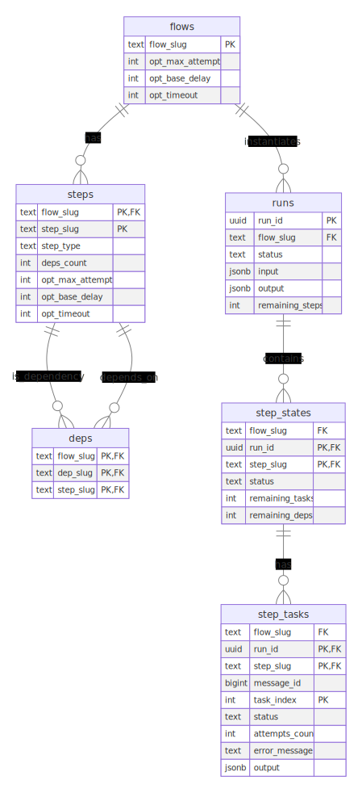
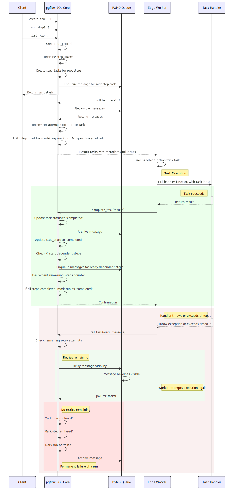
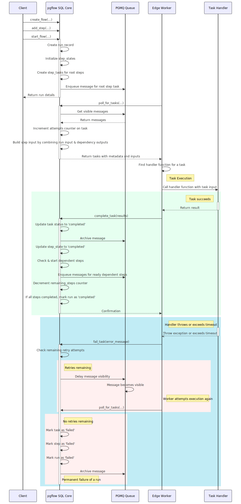

# pgflow SQL Core

PostgreSQL-native workflow engine for defining, managing, and tracking DAG-based workflows directly in your database.

> [!NOTE]
> This project is licensed under [AGPL v3](./LICENSE.md) license and is part of **pgflow** stack.
> See [LICENSING_OVERVIEW.md](../../LICENSING_OVERVIEW.md) in root of this monorepo for more details.

## Table of Contents

- [Overview](#overview)
- [Key Features](#key-features)
- [Architecture](#architecture)
  - [Schema Design](#schema-design)
  - [Execution Model](#execution-model)
- [Example Flow and its life](#getting-started)
  - [Defining a Workflow](#defining-a-workflow)
  - [Starting a Workflow Run](#starting-a-workflow-run)
  - [Workflow Execution](#workflow-execution)
    - [Task Polling](#task-polling)
    - [Task Completion](#task-completion)
    - [Error Handling](#error-handling)
    - [Retries and Timeouts](#retries-and-timeouts)
- [TypeScript Flow DSL](#typescript-flow-dsl)
  - [Overview](#overview-1)
  - [Type Inference System](#type-inference-system)
  - [Basic Example](#basic-example)
  - [How Payload Types Are Built](#how-payload-types-are-built)
  - [Benefits of Automatic Type Inference](#benefits-of-automatic-type-inference)
- [Data Flow](#data-flow)
  - [Input and Output Handling](#input-and-output-handling)
  - [Run Completion](#run-completion)
- [Advanced Usage](#advanced-usage)

## Overview

The pgflow SQL Core provides the data model, state machine, and transactional functions for workflow management. It treats workflows as Directed Acyclic Graphs (DAGs) of steps, each step being a simple state machine.

This package focuses on:

- Defining and storing workflow shapes
- Managing workflow state transitions
- Exposing transactional functions for workflow operations
- Providing APIs for task polling and status updates

The actual execution of workflow tasks is handled by the [Edge Worker](../edge-worker/README.md), which calls back to the SQL Core to acknowledge task completion or failure.

## Key Features

- **Declarative Workflows**: Define flows and steps via SQL tables
- **Dependency Management**: Explicit step dependencies with atomic transitions
- **Configurable Behavior**: Per-flow and per-step options for timeouts, retries, and delays
- **Queue Integration**: Built on pgmq for reliable task processing
- **Transactional Guarantees**: All state transitions are ACID-compliant

## Architecture

### Schema Design

[Schema ERD Diagram (click to enlarge)](./schema.svg)

<a href="./schema.svg">
  
</a>

---

The schema consists of two main categories of tables:

#### Static definition tables

- `flows` (just an identity for the workflow with some global options)
- `steps` (DAG nodes belonging to particular `flows`, with option overrides)
- `deps` (DAG edges between `steps`)

#### Runtime state tables

- `runs` (execution instances of `flows`)
- `step_states` (states of individual `steps` within a `run`)
- `step_tasks` (units of work for individual `steps` within a `run`, so we can have fanouts)

### Execution Model

The SQL Core handles the workflow lifecycle through these key operations:

1. **Definition**: Workflows are defined using `create_flow` and `add_step`
2. **Instantiation**: Workflow instances are started with `start_flow`, creating a new run
3. **Task Management**: The [Edge Worker](../edge-worker/README.md) polls for available tasks using `poll_for_tasks`
4. **State Transitions**: When the Edge Worker reports back using `complete_task` or `fail_task`, the SQL Core handles state transitions and schedules dependent steps

[Flow lifecycle diagram (click to enlarge)](./flow-lifecycle.svg)

<a href="./flow-lifecycle.svg"></a>

## Example flow and its life

Let's walk through creating and running a workflow that fetches a website, 
does summarization and sentiment analysis in parallel steps
and saves the results to a database.

### Defining a Workflow

Workflows are defined using two SQL functions: `create_flow` and `add_step`.



In this example, we'll create a workflow with:
- `website` as the entry point ("root step")
- `sentiment` and `summary` as parallel steps that depend on `website`
- `saveToDb` as the final step, depending on both parallel steps

```sql
-- Define workflow with parallel steps
SELECT pgflow.create_flow('analyze_website');
SELECT pgflow.add_step('analyze_website', 'website');
SELECT pgflow.add_step('analyze_website', 'sentiment', deps => ARRAY['website']);
SELECT pgflow.add_step('analyze_website', 'summary', deps => ARRAY['website']);
SELECT pgflow.add_step('analyze_website', 'saveToDb', deps => ARRAY['sentiment', 'summary']);
```

> [!WARNING]
> You need to call `add_step` in topological order, which is enforced by foreign key constraints.

> [!NOTE]
> You can have multiple "root steps" in a workflow. You can even create a root-steps-only workflow
> to process a single input in parallel, because at the end, all of the outputs from steps 
> that does not have dependents ("final steps") are aggregated and saved as run's `output`.

### Starting a Workflow Run

To start a workflow, call `start_flow` with a flow slug and input arguments:

```sql
SELECT * FROM pgflow.start_flow(
  flow_slug => 'analyze_website', 
  input => '{"url": "https://example.com"}'::jsonb
);

--     run_id  | flow_slug       | status  |  input                         | output | remaining_steps 
-- ------------+-----------------+---------+--------------------------------+--------+-----------------
--  <run uuid> | analyze_website | started | {"url": "https://example.com"} | [NULL] |               4
```

When a workflow starts:
- A new `run` record is created
- Initial states for all steps are created
- Root steps are marked as `started`
- Tasks are created for root steps
- Messages are enqueued on PGMQ for worker processing

> [!NOTE]
> The `input` argument must be a valid JSONB object: string, number, boolean, array, object or null.

### Workflow Execution

#### Task Polling

The Edge Worker continuously polls for available tasks using the `poll_for_tasks` function:

```sql
SELECT * FROM pgflow.poll_for_tasks(
  queue_name => 'analyze_website',
  vt => 60, -- visibility timeout in seconds
  qty => 5  -- maximum number of tasks to fetch
);
```

When a task is polled:

1. The message is hidden from other workers for the specified timeout period
2. The task's attempts counter is incremented for retry tracking
3. An input object is built by combining the run input with outputs from completed dependency steps
4. Task metadata and input are returned to the worker

This process happens in a single transaction to ensure reliability. The worker then executes the appropriate handler function based on the task metadata.

#### Task Completion

After successful processing, the worker acknowledges completion:

```sql
SELECT pgflow.complete_task(
  run_id => '<run_uuid>',
  step_slug => 'website',
  task_index => 0, -- we will have multiple tasks for a step in the future
  output => '{"content": "HTML content", "status": 200}'::jsonb
);
```

When a task completes:
1. The task status is updated to 'completed' and the output is saved
2. The message is archived in PGMQ
3. The step state is updated to 'completed'
4. Dependent steps with all dependencies completed are automatically started
5. The run's remaining_steps counter is decremented
6. If all steps are completed, the run is marked as completed with aggregated outputs

#### Error Handling

If a task fails, the worker acknowledges this using `fail_task`:

```sql
SELECT pgflow.fail_task(
  run_id => '<run_uuid>',
  step_slug => 'website',
  task_index => 0,
  error_message => 'Connection timeout when fetching URL'::text
);
```

The system handles failures by:

1. Checking if retry attempts are available
2. For available retries:
   - Keeping the task in 'queued' status
   - Applying exponential backoff for visibility
   - Preventing processing until the visibility timeout expires
3. When retries are exhausted:
   - Marking the task as 'failed'
   - Marking the step as 'failed'
   - Marking the run as 'failed'
   - Archiving the message in PGMQ
   - Notifying workers to abort pending tasks (future feature)

#### Retries and Timeouts

Retry behavior can be configured at both the flow and step level:

```sql
-- Flow-level defaults
SELECT pgflow.create_flow(
  flow_slug => 'analyze_website',
  max_attempts => 3,    -- Maximum retry attempts (including first attempt)
  base_delay => 5,      -- Base delay in seconds for exponential backoff
  timeout => 60         -- Task timeout in seconds
);

-- Step-level overrides
SELECT pgflow.add_step(
  flow_slug => 'analyze_website',
  step_slug => 'sentiment',
  deps_slugs => ARRAY['website']::text[],
  max_attempts => 5,    -- Override max attempts for this step
  base_delay => 2,      -- Override base delay for exponential backoff
  timeout => 30         -- Override timeout for this step
);
```

The system applies exponential backoff for retries using the formula:
```
delay = base_delay * (2 ^ attempts_count)
```

Timeouts are enforced by setting the message visibility timeout to the step's timeout value plus a small buffer. If a worker doesn't acknowledge completion or failure within this period, the task becomes visible again and can be retried.

## TypeScript Flow DSL

> [!NOTE]
> TypeScript Flow DSL is a Work In Progress and is not ready yet!

### Overview

While the SQL Core engine handles workflow definitions and state management, the primary way to define and work with your workflow logic is via the Flow DSL in TypeScript. This DSL offers a fluent API that makes it straightforward to outline the steps in your flow with full type safety.

### Type Inference System

The most powerful feature of the Flow DSL is its **automatic type inference system**:

1. You only need to annotate the initial Flow input type
2. The return type of each step is automatically inferred from your handler function
3. These return types become available in the payload of dependent steps
4. The TypeScript compiler builds a complete type graph matching your workflow DAG

This means you get full IDE autocompletion and type checking throughout your workflow without manual type annotations.

### Basic Example

Here's an example that matches our website analysis workflow:

```ts
// Provide a type for the input of the Flow
type Input = {
  url: string;
};

const AnalyzeWebsite = new Flow<Input>({
  slug: "analyze_website",
  maxAttempts: 3,
  baseDelay: 5,
  timeout: 10,
})
  .step({ slug: "website" }, async (input) => await scrapeWebsite(input.run.url))
  .step(
    { slug: "sentiment", dependsOn: ["website"], timeout: 30, maxAttempts: 5 },
    async (input) => await analyzeSentiment(input.website.content)
  )
  .step(
    { slug: "summary", dependsOn: ["website"] },
    async (input) => await summarizeWithAI(input.website.content)
  )
  .step(
    { slug: "saveToDb", dependsOn: ["sentiment", "summary"] },
    async (input) =>
      await saveToDb({
        websiteUrl: input.run.url,
        sentiment: input.sentiment.score,
        summary: input.summary,
      }).status
  );
```

### How Payload Types Are Built

The payload object for each step is constructed dynamically based on:

1. **The `run` property**: Always contains the original workflow input
2. **Dependency outputs**: Each dependency's output is available under a key matching the dependency's ID
3. **DAG structure**: Only outputs from direct dependencies are included in the payload

This means your step handlers receive exactly the data they need, properly typed, without any manual type declarations beyond the initial Flow input type.

### Benefits of Automatic Type Inference

- **Refactoring safety**: Change a step's output, and TypeScript will flag all dependent steps that need updates
- **Discoverability**: IDE autocompletion shows exactly what data is available in each step
- **Error prevention**: Catch typos and type mismatches at compile time, not runtime
- **Documentation**: The types themselves serve as living documentation of your workflow's data flow

## Data Flow

### Input and Output Handling

Handlers in pgflow **must return** JSON-serializable values that are captured and saved when `complete_task` is called. These outputs become available as inputs to dependent steps, allowing data to flow through your workflow pipeline.

When a step is executed, it receives an input object where:
- Each key is a step_slug of a completed dependency
- Each value is that step's output
- A special "run" key contains the original workflow input

#### Example: `sentiment`

When the `sentiment` step runs, it receives:

```json
{
  "run": {"url": "https://example.com"},
  "website": {"content": "HTML content", "status": 200}
}
```

#### Example: `saveToDb`

The `saveToDb` step depends on both `sentiment` and `summary`:

```json
{
  "run": {"url": "https://example.com"},
  "sentiment": {"score": 0.85, "label": "positive"},
  "summary": "This website discusses various topics related to technology and innovation."
}
```

### Run Completion

When all steps in a run are completed, the run status is automatically updated to 'completed' and its output is set. The output is an aggregation of all the outputs from final steps (steps that have no dependents):

```sql
-- Example of a completed run with output
SELECT run_id, status, output FROM pgflow.runs WHERE run_id = '<run_uuid>';

--     run_id  | status    | output
-- ------------+-----------+-----------------------------------------------------
--  <run uuid> | completed | {"saveToDb": {"status": "success"}}
```
