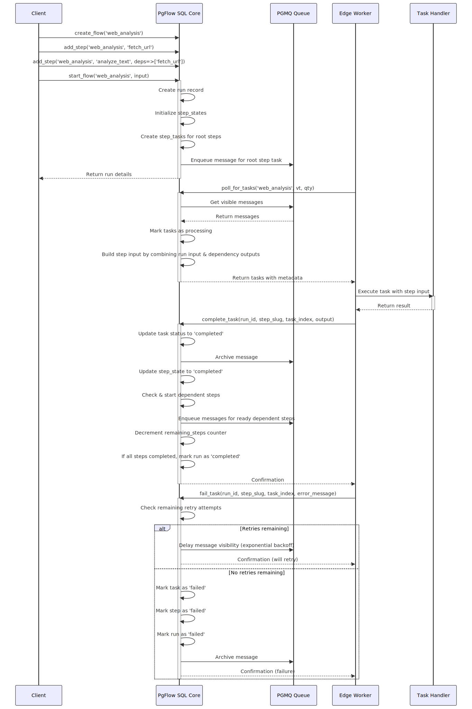

# pgflow SQL Core

PostgreSQL-native workflow engine for defining, managing, and tracking DAG-based workflows directly in your database.

> [!NOTE]
> This project is licensed under [AGPL v3](./LICENSE.md) license and is part of **pgflow** stack.
> See [LICENSING_OVERVIEW.md](../../LICENSING_OVERVIEW.md) in root of this monorepo for more details.

## Overview

The pgflow SQL Core provides the data model, state machine, and transactional functions for workflow management. It treats workflows as DAGs of steps, each step being a simple state machine. This package focuses on:

- Defining and storing workflow shapes
- Managing workflow state transitions
- Exposing transactional functions for workflow operations
- Providing APIs for task polling and status updates

The actual execution of workflow tasks is handled by the [Edge Worker](../edge-worker/README.md), which calls back to the SQL Core to acknowledge task completion or failure.

### Lifecycle of a workflow run

<a href="./flow_lifecycle.svg"></a>

## Features

- **Declarative Workflows**: Define flows and steps via SQL tables
- **Dependency Management**: Explicit step dependencies with atomic transitions
- **Configurable Behavior**: Per-flow and per-step options for timeouts, retries, and delays
- **Queue Integration**: Built on pgmq for reliable task processing
- **Transactional Guarantees**: All state transitions are ACID-compliant

## Execution Model

The SQL Core handles the workflow lifecycle through these key operations:

1. **Definition**: Workflows are defined using `create_flow` and `add_step`
2. **Instantiation**: Workflow instances are started with `start_flow`, creating a new run
3. **Task Management**: The [Edge Worker](../edge-worker/README.md) polls for available tasks using `poll_for_tasks`
4. **State Transitions**: When the Edge Worker reports back using `complete_task` or `fail_task`, the SQL Core handles state transitions and schedules dependent steps

## Schema Design

(click to view bigger image)

<a href="./schema.svg"></a>

### Static definition tables

- `flows` (just an identity for the workflow with some global options)
- `steps` (DAG nodes belonging to particular `flows`, with option overrides)
- `deps` (DAG edges between `steps`)

### Runtime state tables

- `runs` (execution instances of `flows`)
- `step_states` (states of individual `steps` within a `run`)
- `step_tasks` (units of work for individual `steps` within a `run`, so we can have fanouts)

## Example Flow and its lifecycle

We will create and start a workflow that fetches a URL, analyzes the content, and extracts images from the content,
then creates a report from the results.

### Define shape of the flow

Defining a flow is done using two SQL functions: `create_flow` and `add_step`.

`add_step` accepts an optional `deps` array of step slugs that the new step depends on.

To define the following workflow (left to right), where:

- `fetch_url` is entry point ("root step" in pgflow nomenclature)
- `analyze_text` and `extract_images` are parallel steps, depending on `fetch_url`
- `create_report` is a final step, depending on `analyze_text` and `extract_images`



You would call the following SQL functions:

```sql
-- Define workflow with parallel steps
SELECT pgflow.create_flow('web_analysis');
SELECT pgflow.add_step('web_analysis', 'fetch_url');
SELECT pgflow.add_step('web_analysis', 'analyze_text', deps => ARRAY['fetch_url']);
SELECT pgflow.add_step('web_analysis', 'extract_images', deps => ARRAY['fetch_url']);
SELECT pgflow.add_step('web_analysis', 'create_report', deps => ARRAY['analyze_text', 'extract_images']);
```

> [!WARNING]
> You need to call `add_step` in topological order, which is enforced by foreign key constraints.
> Isn't it neat?

> [!NOTE]
> You can have an arbitrary number of "root steps". 
> You can even create a flow with multiple root steps only - they will be converged
> at the end of a run and their `output`s saved as the run's `output`

### Starting a flow run

To start a flow, you just need to call `start_flow` with a flow slug and JSONB object representing input arguments.

```sql
SELECT * FROM pgflow.start_flow(
  flow_slug => 'web_analysis', 
  input => '{"url": "https://example.com"}'::jsonb
);

--     run_id  | flow_slug    | status  |  input                         | output | remaining_steps 
-- ------------+--------------+---------+--------------------------------+--------+-----------------
--  <run uuid> | web_analysis | started | {"url": "https://example.com"} | [NULL] |               4
```

This will:

- create a new `run` record
- create initial state for each step (`step_states` rows)
- start root steps (in our case `fetch_url`) by marking them `started`
- create a task for the root steps (tasks are units of work and used by workers)
- enqueue a message on PGMQ queue that carries metadata about the `step_task`

> [!NOTE]
> The `input` argument must be a valid JSONB object: string, number, boolean, array, object or null.

### Worker polls for tasks and executes handlers

The Edge Worker continuously polls for available tasks using the `poll_for_tasks` function, which returns tasks ready for processing:

```sql
SELECT * FROM pgflow.poll_for_tasks(
  queue_name => 'web_analysis',
  vt => 60, -- visibility timeout in seconds
  qty => 5  -- maximum number of tasks to fetch
);
```

When a task is polled, we:

1. Hide the message from other workers for the specified `timeout + 2s` (configurable per flow and step basis)
1. Increment the task's attempts counter for retry tracking
1. Build step `input` object by combining the run input with outputs from completed dependency steps (more on this later)
1. Task metadata (flow_slug, step_slug, run_id) and step `input` are returned to the worker

This happens in a single transaction, so if the worker dies, the task is not lost.
Then, the worker executes the appropriate handler function based on task metadata.
It calls it with step `input` payload (more on handlers later!)

### Worker acknowledges completion of successful executions

After a task is successfully processed, the worker calls `complete_task` to acknowledge completion:

```sql
SELECT pgflow.complete_task(
  run_id => '<run_uuid>',
  step_slug => 'fetch_url',
  task_index => 0, -- we will have multiple tasks for a step in the future
  output => '{"content": "HTML content", "status": 200}'::jsonb
);
```

When a task is completed:
1. The task status is updated to 'completed' and the `output` is saved
2. The message is archived in the PGMQ archive table.
3. The corresponding `step_state` is updated to 'completed'
4. Any dependent steps that now have all dependencies completed are automatically started
5. The run's remaining_steps counter is decremented
6. If all steps are completed, the run is marked as completed and final outputs are aggregated in the same way, as `input` for a task is produced

### Worker acknowledges failure of executions

If a task fails during processing, the worker acknowledges this using `fail_task`:

```sql
SELECT pgflow.fail_task(
  run_id => '<run_uuid>',
  step_slug => 'fetch_url',
  task_index => 0, -- we will have multiple tasks for a step in the future
  error_message => 'Connection timeout when fetching URL'::text
);
```

When a task fails:

1. The system checks if there are remaining retry attempts available
2. If retries are available:
   - The task remains in 'queued' status for another attempt
   - The message is given a delayed visibility based on exponential backoff
   - No worker is able to process the task until the visibility timeout expires
3. If no retries remain:
   - The task is marked as 'failed'
   - The step is marked as 'failed'
   - The run is marked as 'failed'
   - The message is archived in the PGMQ archive table
   - Workers are notified of run failure and abort any pending tasks (to be implemented!)

### Retries and timeouts

Retry behavior can be configured at both the flow and step level:

```sql
-- Flow-level defaults
SELECT pgflow.create_flow(
  flow_slug => 'web_analysis',
  max_attempts => 3,    -- Maximum retry attempts (including first attempt)
  base_delay => 5,      -- Base delay in seconds for exponential backoff
  timeout => 60         -- Task timeout in seconds
);

-- Step-level overrides
SELECT pgflow.add_step(
  flow_slug => 'web_analysis',
  step_slug => 'fetch_url',
  deps_slugs => ARRAY[]::text[],
  max_attempts => 5,    -- Override max attempts for this step
  base_delay => 2,      -- Override base delay for exponential backoff
  timeout => 30         -- Override timeout for this step
);
```

The system applies exponential backoff for retries using the formula:
```
delay = base_delay * (2 ^ attempts_count)
```

Timeouts are enforced by setting the message visibility timeout to the step's timeout value plus a small buffer. 
Edge Worker will use `timeout` (without the buffer) to terminate any pending tasks that exceed this limit.
If a worker doesn't acknowledge completion or failure within this period, the task becomes visible again and can be retried.

### Run completion with output

When all steps in a run are completed, the run status is automatically updated to 'completed' and its output is set. The output is an aggregation of all the outputs from final steps (steps that have no dependents):

```sql
-- Example of a completed run with output
SELECT run_id, status, output FROM pgflow.runs WHERE run_id = '<run_uuid>';

--     run_id  | status    | output
-- ------------+-----------+-----------------------------------------------------
--  <run uuid> | completed | {"create_report": {"summary": "...", "images": 5}}
```

## Inputs and Outputs

Handlers in pgflow **must return** JSON-serializable values that are captured and saved when `complete_task` is called. These outputs become available as inputs to dependent steps, allowing data to flow through your workflow pipeline.

When a step is executed, it receives an input object where each key is a step_slug of a completed dependency, with the value being that step's output. Each step also receives a special "run" key containing the original input the flow was started with.

### Example: `analyze_text`

When the `analyze_text` step runs, it receives an input object containing the output from its dependency (`fetch_url`) and the original run input. This allows the handler to access both the initial parameters and the results of previous steps.

```json
{
  "run": {"url": "https://example.com"},
  "fetch_url": {"content": "HTML content", "status": 200}
}
```

### Example: `create_report`

The `create_report` step depends on both `analyze_text` and `extract_images`. Its input object will contain outputs from both dependencies along with the original run input.

```json
{
  "run": {"url": "https://example.com"},
  "analyze_text": {"sentiment": "positive", "word_count": 1250},
  "extract_images": {"images": ["image1.jpg", "image2.jpg"], "count": 2}
}
```
