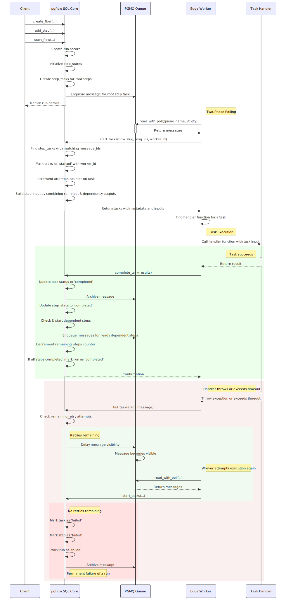

# pgflow SQL Core

PostgreSQL-native workflow engine for defining, managing, and tracking DAG-based workflows directly in your database.

> [!NOTE]
> This project and all its components are licensed under [Apache 2.0](./LICENSE) license.

## Table of Contents

- [Overview](#overview)
- [Key Features](#key-features)
- [Architecture](#architecture)
  - [Schema Design](#schema-design)
  - [Execution Model](#execution-model)
- [Example Flow and its life](#example-flow-and-its-life)
  - [Defining a Workflow](#defining-a-workflow)
  - [Starting a Workflow Run](#starting-a-workflow-run)
  - [Workflow Execution](#workflow-execution)
    - [Task Polling](#task-polling)
    - [Task Completion](#task-completion)
    - [Error Handling](#error-handling)
    - [Retries and Timeouts](#retries-and-timeouts)
- [TypeScript Flow DSL](#typescript-flow-dsl)
  - [Overview](#overview-1)
  - [Type Inference System](#type-inference-system)
  - [Basic Example](#basic-example)
  - [How Payload Types Are Built](#how-payload-types-are-built)
  - [Benefits of Automatic Type Inference](#benefits-of-automatic-type-inference)
- [Data Flow](#data-flow)
  - [Input and Output Handling](#input-and-output-handling)
  - [Run Completion](#run-completion)

## Overview

The pgflow SQL Core provides the data model, state machine, and transactional functions for workflow management. It treats workflows as Directed Acyclic Graphs (DAGs) of steps, each step being a simple state machine.

This package focuses on:

- Defining and storing workflow shapes
- Managing workflow state transitions
- Exposing transactional functions for workflow operations
- Providing two-phase APIs for reliable task polling and status updates

The actual execution of workflow tasks is handled by the [Edge Worker](../edge-worker/README.md), which calls back to the SQL Core to acknowledge task completion or failure.

## Requirements

> [!IMPORTANT] > **pgmq Version Requirement** (since v0.8.0)
>
> pgflow v0.8.0 and later requires **pgmq 1.5.0 or higher**. This version of pgflow will NOT work with pgmq 1.4.x or earlier.
>
> - **Supabase Cloud**: Recent versions include pgmq 1.5.0+ by default
> - **Self-hosted**: You must upgrade pgmq to version 1.5.0+ before upgrading pgflow
> - **Version Check**: Run `SELECT extversion FROM pg_extension WHERE extname = 'pgmq';` to verify your pgmq version

## Key Features

- **Declarative Workflows**: Define flows and steps via SQL tables
- **Dependency Management**: Explicit step dependencies with atomic transitions
- **Configurable Behavior**: Per-flow and per-step options for timeouts, retries, and delays
- **Queue Integration**: Built on pgmq for reliable task processing
- **Transactional Guarantees**: All state transitions are ACID-compliant

## Architecture

### Schema Design

[Schema ERD Diagram (click to enlarge)](./assets/schema.svg)

<a href="./assets/schema.svg">
  
</a>

---

The schema consists of two main categories of tables:

#### Static definition tables

- `flows` (just an identity for the workflow with some global options)
- `steps` (DAG nodes belonging to particular `flows`, with option overrides)
- `deps` (DAG edges between `steps`)

#### Runtime state tables

- `runs` (execution instances of `flows`)
- `step_states` (states of individual `steps` within a `run`)
- `step_tasks` (units of work for individual `steps` within a `run`, so we can have fanouts)

### Execution Model

The SQL Core handles the workflow lifecycle through these key operations:

1. **Definition**: Workflows are defined using `create_flow` and `add_step`
2. **Instantiation**: Workflow instances are started with `start_flow`, creating a new run
3. **Task Retrieval**: The [Edge Worker](../edge-worker/README.md) uses two-phase polling - first `read_with_poll` to reserve queue messages, then `start_tasks` to convert them to executable tasks
4. **State Transitions**: When the Edge Worker reports back using `complete_task` or `fail_task`, the SQL Core handles state transitions and schedules dependent steps

[Flow lifecycle diagram (click to enlarge)](./assets/flow-lifecycle.svg)

<a href="./assets/flow-lifecycle.svg"></a>

## Step Types

pgflow supports two fundamental step types that control how tasks are created and executed:

### Single Steps (Default)

Single steps are the standard step type where each step creates exactly one task when started. These steps process their input as a whole and return a single output value.

```sql
-- Regular single step definition
SELECT pgflow.add_step('my_flow', 'process_data');
```

### Map Steps

Map steps enable parallel processing of arrays by automatically creating multiple tasks - one for each array element. The system handles task distribution, parallel execution, and output aggregation transparently.

```sql
-- Map step definition (step_type => 'map')
SELECT pgflow.add_step(
  flow_slug => 'my_flow',
  step_slug => 'process_items',
  deps_slugs => ARRAY['fetch_items'],
  step_type => 'map'
);
```

#### Key Characteristics

- **Multiple Task Creation**: The SQL core creates N tasks for a map step (one per array element), unlike single steps which create one task
- **Element Distribution**: The SQL core distributes individual array elements to tasks based on `task_index`
- **Output Aggregation**: The SQL core aggregates task outputs back into an array for dependent steps
- **Constraint**: Map steps can have at most one dependency (which must return an array), or zero dependencies (then flow input must be an array)

#### Map Step Execution Flow

1. **Array Input Validation**: The SQL core validates that the input is an array
2. **Task Creation**: The SQL core creates N tasks with indices 0 to N-1
3. **Element Distribution**: The SQL core assigns `array[task_index]` as input to each task
4. **Parallel Execution**: Edge workers execute tasks independently in parallel
5. **Output Collection**: The SQL core aggregates outputs preserving array order
6. **Dependent Activation**: The SQL core passes the aggregated array to dependent steps

#### Root Map vs Dependent Map

**Root Map Steps** process the flow's input array directly:

```sql
-- Root map: no dependencies, processes flow input
SELECT pgflow.add_step(
  flow_slug => 'batch_processor',
  step_slug => 'process_each',
  step_type => 'map'
);

-- Starting the flow with array input
SELECT pgflow.start_flow(
  flow_slug => 'batch_processor',
  input => '[1, 2, 3, 4, 5]'::jsonb
);
```

**Dependent Map Steps** process another step's array output:

```sql
-- Dependent map: processes the array from 'fetch_items'
SELECT pgflow.add_step(
  flow_slug => 'data_pipeline',
  step_slug => 'transform_each',
  deps_slugs => ARRAY['fetch_items'],
  step_type => 'map'
);
```

#### Edge Cases and Special Behaviors

1. **Empty Array Cascade**: When a map step receives an empty array (`[]`):

   - The SQL core completes it immediately without creating tasks
   - The completed map step outputs an empty array
   - Any dependent map steps also receive empty arrays and complete immediately
   - This cascades through the entire chain of map steps in a single transaction
   - Example: `[] → map1 → [] → map2 → [] → map3 → []` all complete together

2. **NULL Values**: NULL array elements are preserved and distributed to their respective tasks

3. **Non-Array Input**: The SQL core fails the step when input is not an array

4. **Type Violations**: When a single step outputs non-array data to a map step, the SQL core fails the entire run (stores the invalid output for debugging, archives all queued messages, prevents orphaned tasks)

#### Implementation Details

Map steps utilize several database fields for state management:

- `initial_tasks`: Number of tasks to create (NULL until array size is known)
- `remaining_tasks`: Tracks incomplete tasks for the step
- `task_index`: Identifies which array element each task processes
- `step_type`: Column value 'map' triggers map behavior

The aggregation process ensures:

- **Order Preservation**: Task outputs maintain array element ordering
- **NULL Handling**: NULL outputs are included in the aggregated array
- **Atomicity**: Aggregation occurs within the same transaction as task completion

## Example flow and its life

Let's walk through creating and running a workflow that fetches a website,
does summarization and sentiment analysis in parallel steps
and saves the results to a database.


### Defining a Workflow

Workflows are defined using two SQL functions: `create_flow` and `add_step`.

In this example, we'll create a workflow with:

- `website` as the entry point ("root step")
- `sentiment` and `summary` as parallel steps that depend on `website`
- `saveToDb` as the final step, depending on both parallel steps

```sql
-- Define workflow with parallel steps
SELECT pgflow.create_flow('analyze_website');
SELECT pgflow.add_step('analyze_website', 'website');
SELECT pgflow.add_step('analyze_website', 'sentiment', deps_slugs => ARRAY['website']);
SELECT pgflow.add_step('analyze_website', 'summary', deps_slugs => ARRAY['website']);
SELECT pgflow.add_step('analyze_website', 'saveToDb', deps_slugs => ARRAY['sentiment', 'summary']);
```

> [!WARNING]
> You need to call `add_step` in topological order, which is enforced by foreign key constraints.

> [!NOTE]
> You can have multiple "root steps" in a workflow. You can even create a root-steps-only workflow
> to process a single input in parallel, because at the end, all of the outputs from steps
> that does not have dependents ("final steps") are aggregated and saved as run's `output`.

### Starting a Workflow Run

To start a workflow, call `start_flow` with a flow slug and input arguments:

```sql
SELECT * FROM pgflow.start_flow(
  flow_slug => 'analyze_website',
  input => '{"url": "https://example.com"}'::jsonb
);

--     run_id  | flow_slug       | status  |  input                         | output | remaining_steps
-- ------------+-----------------+---------+--------------------------------+--------+-----------------
--  <run uuid> | analyze_website | started | {"url": "https://example.com"} | [NULL] |               4
```

When a workflow starts:

- A new `run` record is created
- Initial states for all steps are created
- Root steps are marked as `started`
- Tasks are created for root steps
- Messages are enqueued on PGMQ for worker processing

> [!NOTE]
> The `input` argument must be a valid JSONB object: string, number, boolean, array, object or null.

### Workflow Execution

#### Task Polling

The Edge Worker uses a two-phase approach to retrieve and start tasks:

**Phase 1 - Reserve Messages:**

```sql
SELECT * FROM pgmq.read_with_poll(
  queue_name => 'analyze_website',
  vt => 60, -- visibility timeout in seconds
  qty => 5  -- maximum number of messages to fetch
);
```

**Phase 2 - Start Tasks:**

```sql
SELECT * FROM pgflow.start_tasks(
  flow_slug => 'analyze_website',
  msg_ids => ARRAY[101, 102, 103], -- message IDs from phase 1
  worker_id => '550e8400-e29b-41d4-a716-446655440000'::uuid
);
```

**How it works:**

1. **read_with_poll** reserves raw queue messages and hides them from other workers
2. **start_tasks** finds matching step_tasks, increments attempts counter, and builds task inputs
3. Task metadata and input are returned to the worker for execution

This two-phase approach ensures tasks always exist before processing begins, eliminating race conditions that could occur with single-phase polling.

#### Task Completion

After successful processing, the worker acknowledges completion:

```sql
SELECT pgflow.complete_task(
  run_id => '<run_uuid>',
  step_slug => 'website',
  task_index => 0, -- we will have multiple tasks for a step in the future
  output => '{"content": "HTML content", "status": 200}'::jsonb
);
```

When a task completes:

1. The task status is updated to 'completed' and the output is saved
2. The message is archived in PGMQ
3. The step state is updated to 'completed'
4. Dependent steps with all dependencies completed are automatically started
5. The run's remaining_steps counter is decremented
6. If all steps are completed, the run is marked as completed with aggregated outputs

#### Error Handling

If a task fails, the worker acknowledges this using `fail_task`:

```sql
SELECT pgflow.fail_task(
  run_id => '<run_uuid>',
  step_slug => 'website',
  task_index => 0,
  error_message => 'Connection timeout when fetching URL'::text
);
```

The system handles failures by:

1. Checking if retry attempts are available
2. For available retries:
   - Keeping the task in 'queued' status
   - Applying exponential backoff for visibility
   - Preventing processing until the visibility timeout expires
3. When retries are exhausted:
   - Marking the task as 'failed'
   - Storing the task output (even for failed tasks)
   - Marking the step as 'failed'
   - Marking the run as 'failed'
   - Archiving the message in PGMQ
   - **Archiving all queued messages for the failed run** (preventing orphaned messages)
4. Additional failure handling:
   - **No retries on already-failed runs** - tasks are immediately marked as failed
   - **Graceful type constraint violations** - handled without exceptions when single steps feed map steps
   - **Stores invalid output on type violations** - captures the output that caused the violation for debugging
   - **Performance-optimized message archiving** using indexed queries

#### Retries and Timeouts

Retry behavior can be configured at both the flow and step level:

```sql
-- Flow-level defaults
SELECT pgflow.create_flow(
  flow_slug => 'analyze_website',
  max_attempts => 3,    -- Maximum retry attempts (including first attempt)
  base_delay => 5,      -- Base delay in seconds for exponential backoff
  timeout => 60         -- Task timeout in seconds
);

-- Step-level overrides
SELECT pgflow.add_step(
  flow_slug => 'analyze_website',
  step_slug => 'sentiment',
  deps_slugs => ARRAY['website']::text[],
  max_attempts => 5,    -- Override max attempts for this step
  base_delay => 2,      -- Override base delay for exponential backoff
  timeout => 30         -- Override timeout for this step
);
```

The system applies exponential backoff for retries using the formula:

```
delay = base_delay * (2 ^ attempts_count)
```

Timeouts are enforced by setting the message visibility timeout to the step's timeout value plus a small buffer. If a worker doesn't acknowledge completion or failure within this period, the task becomes visible again and can be retried.

## Workflow Definition with TypeScript DSL

The SQL Core is the DAG orchestration engine that handles dependency resolution, step state management, and task spawning. However, workflows are defined using the TypeScript Flow DSL, which compiles user intent into the SQL primitives that populate the definition tables (`flows`, `steps`, `deps`).

See the [@pgflow/dsl package](../dsl/README.md) for complete documentation on:

- Expressing workflows with type-safe method chaining
- Step types (`.step()`, `.array()`, `.map()`)
- Compilation to SQL migrations
- Type inference and handler context

The SQL Core executes these compiled definitions, managing when steps are ready, how many tasks to create (1 for single steps, N for map steps), and how to aggregate results.

## Data Flow

### Input and Output Handling

Handlers in pgflow **must return** JSON-serializable values that are captured and saved when `complete_task` is called. These outputs become available as inputs to dependent steps, allowing data to flow through your workflow pipeline.

When a step is executed, it receives an input object where:

- Each key is a step_slug of a completed dependency
- Each value is that step's output
- A special "run" key contains the original workflow input

#### Example: `sentiment`

When the `sentiment` step runs, it receives:

```json
{
  "run": { "url": "https://example.com" },
  "website": { "content": "HTML content", "status": 200 }
}
```

#### Example: `saveToDb`

The `saveToDb` step depends on both `sentiment` and `summary`:

```json
{
  "run": { "url": "https://example.com" },
  "sentiment": { "score": 0.85, "label": "positive" },
  "summary": "This website discusses various topics related to technology and innovation."
}
```

### Map Step Handler Inputs

Map step tasks receive a fundamentally different input structure than single step tasks. Instead of receiving an object with `run` and dependency keys, **map tasks receive only their assigned array element**:

#### Example: Processing user IDs

```json
// Flow input (for root map) or dependency output:
["user123", "user456", "user789"]

// What each map task receives:
// Task 0: "user123"
// Task 1: "user456"
// Task 2: "user789"

// NOT this:
// { "run": {...}, "dependency": [...] }
```

This means:

- Map handlers process individual elements in isolation
- Map handlers cannot access the original flow input (`run`)
- Map handlers cannot access other dependencies
- Map handlers focus solely on transforming their assigned element

#### Map Step Outputs Become Arrays

When a step depends on a map step, it receives the aggregated array output:

```json
// If 'process_users' is a map step that processed ["user1", "user2"]
// and output [{"name": "Alice"}, {"name": "Bob"}]

// A step depending on 'process_users' receives:
{
  "run": {
    /* original flow input */
  },
  "process_users": [{ "name": "Alice" }, { "name": "Bob" }] // Full array
}
```

### Run Completion

When all steps in a run are completed, the run status is automatically updated to 'completed' and its output is set. The output is an aggregation of all the outputs from final steps (steps that have no dependents):

```sql
-- Example of a completed run with output
SELECT run_id, status, output FROM pgflow.runs WHERE run_id = '<run_uuid>';

--     run_id  | status    | output
-- ------------+-----------+-----------------------------------------------------
--  <run uuid> | completed | {"saveToDb": {"status": "success"}}
```
