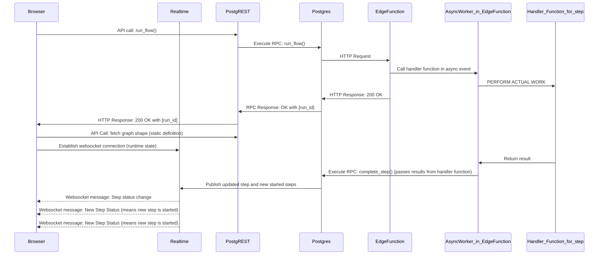

The **Flow Lifecycle** in PGFlow outlines the sequence of events from triggering a workflow to its completion, focusing on seamless integration with your application. This guide explains the process, referencing the provided diagram.



### **1. Triggering a Workflow**

- A workflow is initiated by calling the **`run_flow()`** function on the frontend:
  ```typescript
  const runId = await triggerFlow("FlowName", payload);
  ```
- The frontend makes an **API call** to your backend or directly to **PostgREST**, triggering the **`run_flow()`** RPC in **Postgres**.
- **Postgres** initializes the workflow and returns a **`run_id`**, which uniquely identifies the workflow instance.

---

### **2. Fetching Workflow Graph and Real-Time Setup**

- The frontend retrieves the **graph structure** (static definition) of the workflow via an API call.
- A **WebSocket connection** is established to listen for **real-time updates** about step execution.

---

### **3. Step Execution**

1. **Postgres** identifies the initial steps (root steps without dependencies) and sends an **HTTP request** to the appropriate **Edge Function**.
2. The **Edge Function** invokes an **async worker** to handle the step logic, using the **handler function** for the specific step.
3. The worker **performs the actual work** (e.g., API calls, computation) and returns the result to the Edge Function.
4. The Edge Function sends the results back to **Postgres** via the **`complete_step()` RPC**, updating the step's status and checking for dependent steps.

---

### **4. Dependency Resolution**

- **Postgres** ensures that dependent steps only start once all their dependencies are resolved.
- This process is guarded using **Advisory Locks**, ensuring dependencies are resolved **serially** for each workflow instance.
- Once a step is completed, its dependents are triggered, repeating the process until the workflow finishes.

---

### **5. Real-Time Updates**

- As steps progress, **Postgres** publishes updates to the **Realtime server**, which are relayed to the **browser** via WebSocket.
- The browser receives events like:
  - **Step Started**: Indicates a step has begun execution.
  - **Step Completed**: Indicates a step has successfully finished.

---

### **6. Workflow Completion**

- When the **output step** (the step that aggregates all dependencies) is completed:
  - The final WebSocket event is sent to the browser.
  - The **Promise returned by `triggerFlow()` resolves**, returning the result to the frontend.

---

### **Key Features**

- **Postgres as the Source of Truth**: Workflow state is stored and managed in Postgres, ensuring reliability and consistency.
- **WebSocket for Real-Time Feedback**: Developers get real-time updates for snappy, responsive UIs.
- **Asynchronous Execution**: Steps are processed independently and in parallel where possible.
- **Retries and Error Handling (Planned)**: Future enhancements will include automatic retries and robust error reporting.

---

### **Flow Lifecycle Summary**

1. **Trigger Workflow**: Call `run_flow()` to start.
2. **Setup**: Fetch graph structure and establish WebSocket connection.
3. **Execute Steps**: Steps execute in sequence or parallel based on dependencies.
4. **Track Progress**: Receive real-time updates via WebSocket.
5. **Complete Workflow**: Promise resolves when the output step finishes.

This lifecycle encapsulates backend complexity into an intuitive, frontend-friendly API, empowering developers to build rich, responsive applications effortlessly.
