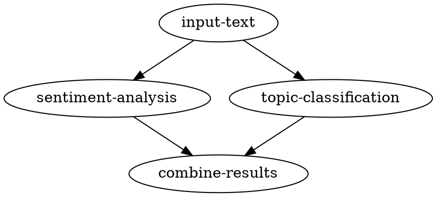

### **Option 1: Define the DAG Using a Declarative Format (YAML)**

**Idea**: Use a language-agnostic declarative format like YAML to define the DAG. This keeps the workflow definition simple, readable, and independent of any programming language.

**Example (workflow.yaml)**:

```yaml
nodes:
  - id: input-text
    type: input
  - id: sentiment-analysis
    type: process
    worker: python  # Indicates implementation language
  - id: topic-classification
    type: process
    worker: typescript
  - id: combine-results
    type: combine

edges:
  - from: input-text
    to: sentiment-analysis
  - from: input-text
    to: topic-classification
  - from: sentiment-analysis
    to: combine-results
  - from: topic-classification
    to: combine-results
```

**Benefits**:

- **Readability**: YAML is human-friendly and easy to read.
- **Simplicity**: Straightforward structure with nodes and edges.
- **Language-Agnostic**: Decouples DAG definition from implementation language.
- **Extensibility**: Easy to add metadata or configurations.

---

### **Option 2: Define the DAG Using a Fluent Interface in Python**

**Idea**: Use a Python DSL with a fluent interface to define the DAG. This approach allows for expressive and readable code, and can leverage Python's syntax for clarity.

**Example (workflow.py)**:

```python
from workflow import Workflow, Node

# Define nodes (could be implemented in different languages)
input_text = Node('input-text')
sentiment_analysis = Node('sentiment-analysis', worker='python')
topic_classification = Node('topic-classification', worker='typescript')
combine_results = Node('combine-results')

# Build workflow
workflow = Workflow('small_nlp')
workflow.connect(input_text, sentiment_analysis)
workflow.connect(input_text, topic_classification)
workflow.connect(sentiment_analysis, combine_results)
workflow.connect(topic_classification, combine_results)

# Alternatively, use chaining for better readability
workflow = (
    Workflow('small_nlp')
    .connect(input_text, sentiment_analysis)
    .connect(input_text, topic_classification)
    .connect(sentiment_analysis, combine_results)
    .connect(topic_classification, combine_results)
)
```

**Benefits**:

- **Readability**: Fluent interface makes the DAG structure clear.
- **Expressiveness**: Leverages Python's syntax for clarity.
- **Flexibility**: Ability to add custom logic if needed.
- **Integration**: Easy to integrate with Python tooling.

---

### **Option 3: Define the DAG Using a Fluent Interface in TypeScript**

**Idea**: Similar to the Python approach, use a TypeScript DSL with a fluent interface to define the DAG.

**Example (workflow.ts)**:

```typescript
import { Workflow, Node } from 'workflow';

// Define nodes
const inputText = new Node('input-text');
const sentimentAnalysis = new Node('sentiment-analysis', { worker: 'python' });
const topicClassification = new Node('topic-classification', { worker: 'typescript' });
const combineResults = new Node('combine-results');

// Build workflow
const workflow = new Workflow('small_nlp')
    .connect(inputText, sentimentAnalysis)
    .connect(inputText, topicClassification)
    .connect(sentimentAnalysis, combineResults)
    .connect(topicClassification, combineResults);

```

**Benefits**:

- **Readability**: Fluent interface in TypeScript is clean and clear.
- **Type Safety**: TypeScript provides compile-time checks.
- **Flexibility**: Can leverage TypeScript features and tooling.

---

### **Option 4: Use an Existing Declarative Language Like DOT**

**Idea**: Use the DOT language itself to define the DAG. Since you're already representing the workflow in Graphviz, you can use this format directly.

**Example (workflow.dot)**:



**Benefits**:

- **Clarity**: DOT language is designed for graphs.
- **Visualization**: Easy to generate visual representations.
- **Language-Agnostic**: Purely declarative and independent.

---

### **Option 5: Define the DAG Using JSON**

**Idea**: Use JSON for the DAG definition, which is language-agnostic and easily parsed in both Python and TypeScript.

**Example (workflow.json)**:

```json
{
  "nodes": [
    {"id": "input-text", "worker": ""},
    {"id": "sentiment-analysis", "worker": "python"},
    {"id": "topic-classification", "worker": "typescript"},
    {"id": "combine-results", "worker": ""}
  ],
  "edges": [
    {"from": "input-text", "to": "sentiment-analysis"},
    {"from": "input-text", "to": "topic-classification"},
    {"from": "sentiment-analysis", "to": "combine-results"},
    {"from": "topic-classification", "to": "combine-results"}
  ]
}
```

**Benefits**:

- **Universality**: JSON is a standard data interchange format.
- **Ease of Parsing**: Both Python and TypeScript have robust JSON support.
- **Language-Agnostic**: Decouples DAG from implementations.

---

### **Option 6: Hybrid Approach Using Code and Declarative Definitions**

**Idea**: Combine the expressiveness of code with the simplicity of declarative definitions. Define the DAG in a declarative format but allow step implementations to be in code.

**Example (workflow.yaml + step implementations)**:

**workflow.yaml**:

```yaml
nodes:
  - id: input-text
  - id: sentiment-analysis
  - id: topic-classification
  - id: combine-results

edges:
  - from: input-text
    to:
      - sentiment-analysis
      - topic-classification
  - from: sentiment-analysis
    to: combine-results
  - from: topic-classification
    to: combine-results
```

**Python Implementation (sentiment_analysis.py)**:

```python
def sentiment_analysis(input_data):
    # Python implementation
    pass
```

**TypeScript Implementation (topic_classification.ts)**:

```typescript
export function topicClassification(inputData: any) {
    // TypeScript implementation
}
```

**Benefits**:

- **Separation of Concerns**: DAG structure is separated from code.
- **Flexibility**: Steps can be implemented in any language.
- **Readability**: Declarative DAG is easy to understand.

---

### **Option 7: Use a Workflow Definition Library (e.g., Apache Airflow DAG in Python)**

**Idea**: Use an established workflow definition library that allows you to define DAGs programmatically.

**Example (workflow_airflow.py)**:

```python
from airflow import DAG
from airflow.operators.python_operator import PythonOperator
from datetime import datetime

def sentiment_analysis(**context):
    # Implementation
    pass

with DAG('small_nlp', start_date=datetime(2023, 1, 1)) as dag:
    input_text = PythonOperator(
        task_id='input_text',
        python_callable=lambda: None  # Placeholder
    )
    sentiment_analysis_task = PythonOperator(
        task_id='sentiment_analysis',
        python_callable=sentiment_analysis
    )
    topic_classification_task = PythonOperator(
        task_id='topic_classification',
        python_callable=lambda: None  # Placeholder
    )
    combine_results = PythonOperator(
        task_id='combine_results',
        python_callable=lambda: None  # Placeholder
    )

    input_text >> [sentiment_analysis_task, topic_classification_task]
    [sentiment_analysis_task, topic_classification_task] >> combine_results
```

**Benefits**:

- **Robustness**: Leveraging a mature system.
- **Features**: Built-in scheduling, monitoring, etc.
- **Familiarity**: For teams already using such tools.

---

### **Recommendation**

Given your requirements, **Option 1 (YAML declarative format)** seems to offer the best balance between readability, simplicity, and language agnosticism. YAML is easy to read and write, and it decouples the workflow definition from the step implementations completely.

However, if you prefer code-based definitions and want to leverage language features, **Option 2 (Python fluent interface)** or **Option 3 (TypeScript fluent interface)** could be more suitable. These options provide a more expressive way to define complex workflows while still allowing steps to be implemented in different languages.

---

### **Conclusion**

Ultimately, the best approach depends on your team's preferences and existing tooling. If cross-language compatibility and simplicity are top priorities, a declarative format like YAML or JSON is recommended. If you prefer leveraging programming language features and have a homogeneous development environment, a fluent interface in Python or TypeScript might provide a better Developer Experience.

---

Feel free to adapt any of these ideas to suit your specific needs, and consider combining approaches if that enhances the Developer Experience for your team.
