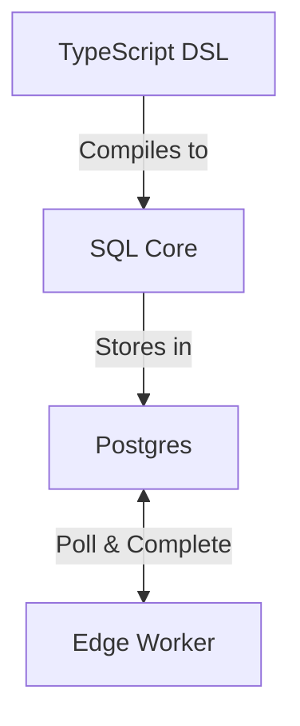
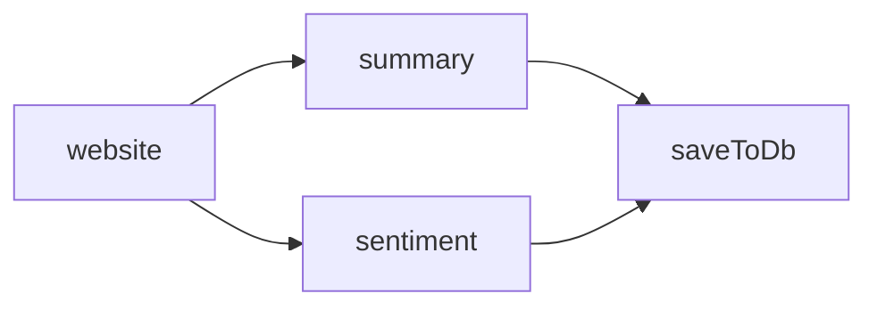

pgflow is a Postgres-native workflow engine with three simple layers:

## The Three Layers

1. **TypeScript DSL**: Define workflows with type safety
2. **SQL Core**: Orchestrate workflows inside Postgres
3. **Edge Worker**: Execute tasks in Supabase Edge Functions

## How It Works

1. **Define** workflow as a DAG of steps in TypeScript
2. **Compile** to SQL migration that creates workflow in database
3. **Start** a run with input data
4. **Execute** tasks via stateless workers that poll for work
5. **Complete** runs automatically when all steps finish

## Core Principles

- **Database is the truth**: All state lives in Postgres tables
- **Workflows are immutable**: Once defined, shapes don't change
- **Automatic orchestration**: Steps start when dependencies complete
- **Idempotent operations**: Safe to retry or reapply definitions
- **Stateless workers**: Can restart or scale without losing work

## Data Flow Example

- Each step gets the original run input and outputs from its dependencies
- When a step completes, its output is stored and dependents are scheduled
- Final run output combines all outputs from leaf steps
