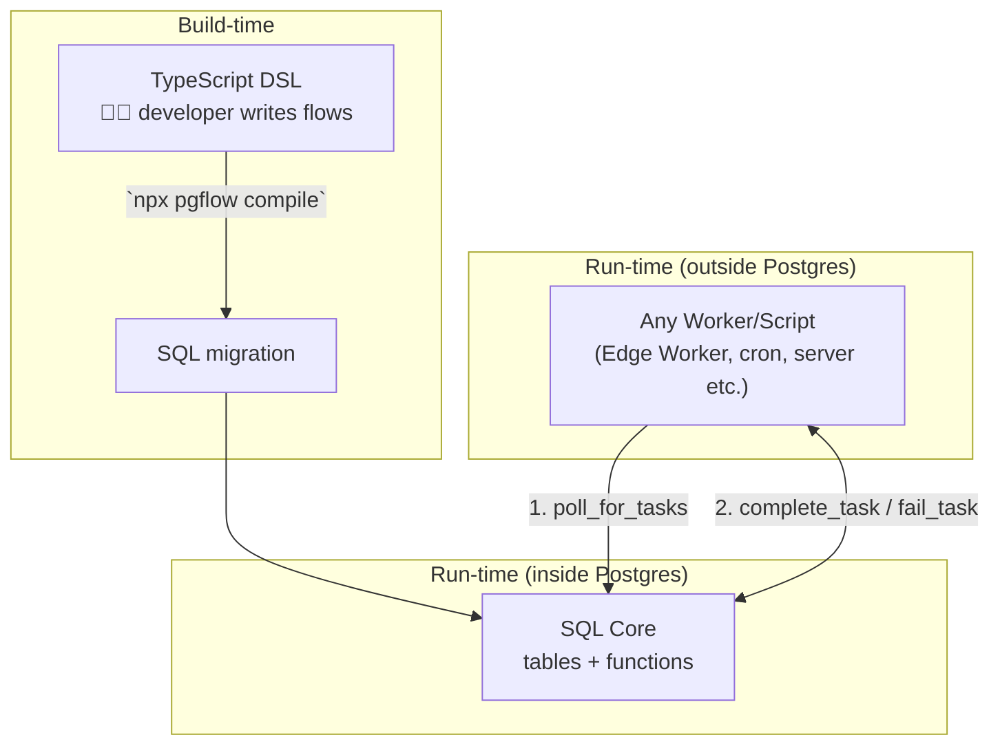

import { Aside } from "@astrojs/starlight/components";

pgflow is deliberately simple inside:
a few SQL tables, couple of SQL functions, and thin helpers around them.
Yet those pieces compose into a full workflow engine with **Postgres as the single source of truth**.

This page walks you through the **mental model** in three short hops:

1. The three layers (DSL → SQL Core → Worker)
2. The life-cycle of a task (`poll_for_tasks → complete_task | fail_task`)
3. Why type safety and queues matter

pgflow follows four core design principles:
- **Postgres-first**: All state and orchestration logic in your database
- **Opinionated over configurable**: Simple, sensible defaults that work for most cases
- **Robust yet simple**: Reliability without complexity
- **Compile-time safety**: Catch flow definition errors before runtime

---

## 1. Three thin layers



Layer cheat-sheet:

| Layer | What it does | Lives where |
|-------|--------------|-------------|
| **TypeScript DSL** | Describe the flow shape with full type inference | Your repo |
| **SQL Core** | Owns all **state** & orchestration logic | A handful of Postgres tables + functions |
| **Worker** | Executes user code, then **reports back** | Edge Function by default (but can be anything) |

<Aside type="tip" title="Swap the Worker if you like">
Edge Worker is just a convenience wrapper.
Any process that can *call* `poll_for_tasks` and later *call* `complete_task` (or `fail_task`) will work.
This modular design lets you use pgflow with any runtime environment that can connect to Postgres.
</Aside>

---

## 2. All state lives in SQL 📊

pgflow uses two categories of tables:

**Definition tables:**
- `flows` - Workflow identities and global options
- `steps` - DAG nodes with option overrides
- `deps` - DAG edges between steps

**Runtime tables:**
- `runs` - One row per workflow execution
- `step_states` - Tracks each step's **status / deps / tasks**
- `step_tasks` - One row per retryable *task* (fan-outs come later)

Because updates happen **inside the same transaction** that handles the queue message, pgflow gets ACID guarantees "for free".

---

## 3. The execution cycle

1. **Worker calls** `poll_for_tasks(queue, vt, qty)`
   • Locks & returns up-to-`qty` ready tasks
   • Builds an *input object* that merges `run.input` with outputs of completed deps
2. Worker runs your handler function.
3. On success → `complete_task(run_id, step_slug, task_index, output)`
   On error   → `fail_task(run_id, step_slug, task_index, error)`
4. SQL Core, in the *same commit*:
   - stores output / error
   - moves step & run state forward
   - enqueues next steps if deps are met
   - handles errors with configurable retry logic and exponential backoff

Retry settings are configurable at both flow and step levels, with sensible defaults:
- When a task fails, it's automatically retried if attempts remain
- Each retry uses exponential backoff (base_delay * 2^attempts) to avoid overload
- When retries are exhausted, the step and flow are marked as failed

That's it—**two SQL calls** advance the entire graph.

### Looks just like "queue-of-queues"

If you ever wrote code that:

```pseudo
job = dequeue()
process(job)
enqueue(next_job)
```

…then you already understand pgflow.
The SQL Core simply *wraps* that pattern so you stop rewriting it.

---

## 4. Ultra-short example (2 sequential steps)

### Flow definition

```typescript title="supabase/functions/_flows/greet_user.ts"
import { Flow } from "npm:@pgflow/dsl";

type Input = { first: string; last: string };

export default new Flow<Input>({ slug: "greet_user" })
  .step(
    { slug: "full_name" },
    (input) => `${input.run.first} ${input.run.last}`           // ⇐ return type inferred
  )
  .step(
    { slug: "greeting", dependsOn: ["full_name"] },
    (input) => `Hello, ${input.full_name}!`                     // ⇐ safe access, full IntelliSense
  );
```

### What the compiler generates

```sql
SELECT pgflow.create_flow('greet_user');
SELECT pgflow.add_step('greet_user', 'full_name');
SELECT pgflow.add_step('greet_user', 'greeting', ARRAY['full_name']);
```

No boilerplate, no hand-written DAG SQL.

---

## 5. Type safety from end to end

Only the **initial input type** is annotated (`Input`).
Every other type is **inferred**:

- Return type of `full_name` ➜ becomes `input.full_name` type
- The compiler prevents you from referencing `input.summary` if it does not exist
- Refactors propagate instantly—change one handler's return type, dependent steps turn red in your IDE

<Aside type="note">
This eliminates a whole class of runtime bugs: accessing data that will never be produced.
</Aside>

When a step executes, its input combines the flow input with outputs from dependencies:

```json
// If 'greeting' depends on 'full_name', its input looks like:
{
  "run": { "first": "Jane", "last": "Doe" },
  "full_name": "Jane Doe"
}
```

---

## 6. Why "poll + complete" is liberating

Because *all* orchestration lives in the database:

- Workers are **stateless** – they can crash or scale horizontally
- You can mix & match: one flow processed by Edge Functions, another by a Rust service
- Observability is trivial—`SELECT * FROM pgflow.runs` is your dashboard

The Edge Worker adds powerful reliability features:
- **Automatic retries** with exponential backoff for transient failures
- **Concurrency control** for processing multiple tasks in parallel
- **Auto-restarts** to handle Edge Function CPU/memory limits
- **Horizontal scaling** with multiple worker instances

---

## Recap

1. **Three simple layers** keep concerns separate.
2. **All state** is in Postgres tables—easy to query, backup, and reason about.
3. **Two SQL functions** (`poll_for_tasks`, `complete_task` / `fail_task`) advance the graph transactionally.
4. The model feels like "a job queue that enqueues the next job", but pgflow does the wiring.
5. **Type inference** guarantees that every step only consumes data that actually exists.

You now have the core mental model needed for the rest of the docs—no more than ten minutes well spent 🚀
