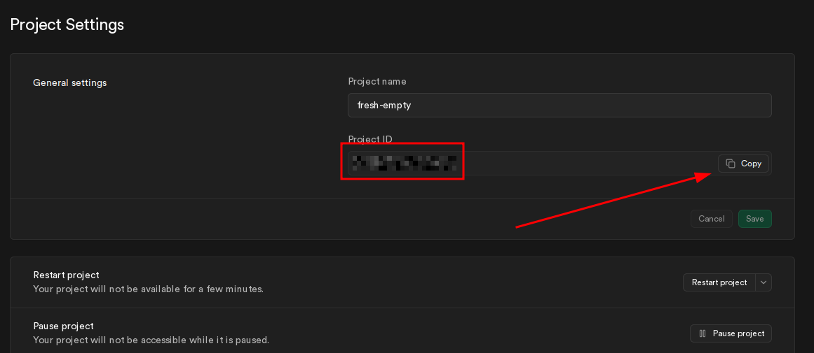
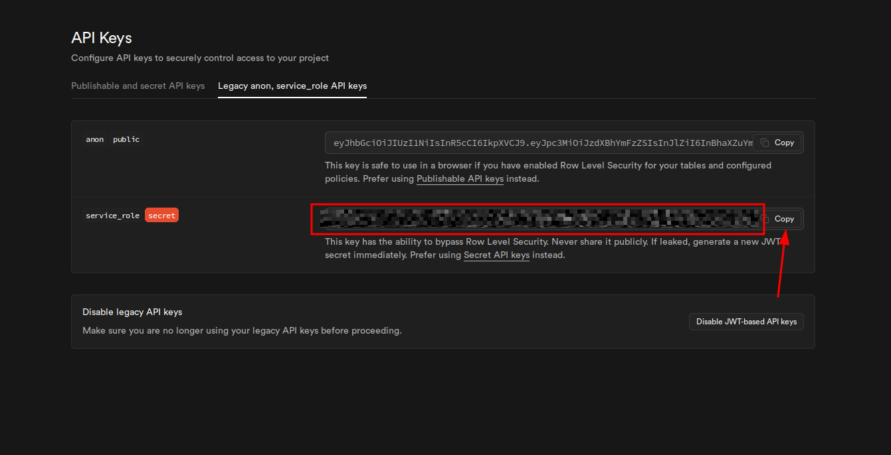

import { Aside, Steps, Tabs, TabItem } from '@astrojs/starlight/components';

pgflow needs vault secrets to automatically manage workers in production.

<Steps>

1. ### Get your Project ID

   1. Open [Supabase Dashboard](https://supabase.com/dashboard)
   2. Select your project
   3. Go to **Project Settings** -> **General**
   4. Copy the **Project ID**

   

2. ### Get your service role key

   1. Go to **Project Settings** -> **API Keys**
   2. Click the **Legacy anon, service_role API keys** tab
   3. Find `service_role` (labeled "secret") and click **Copy**

   

   <Aside type="caution">
     Keep this key secret - it bypasses Row Level Security.
   </Aside>

3. ### Create vault secrets

   The service role key needs to be stored in two places:

   - **Vault** - so the database can authenticate when calling the worker
   - **Edge Function secret** (step 4) - so the worker can validate incoming requests

   Run in the SQL Editor:

   ```sql "your-project-id" "your-service-role-key"
   SELECT vault.create_secret('your-project-id', 'supabase_project_id');
   SELECT vault.create_secret('your-service-role-key', 'pgflow_auth_secret');
   ```

   Replace the highlighted values with your actual Project ID and service role key from steps 1 and 2.

4. ### Set the Edge Function auth secret

   Set `PGFLOW_AUTH_SECRET` to the same service role key you stored in vault:

   <Tabs>
     <TabItem label="Dashboard">
       1. Go to **Edge Functions** in the sidebar 2. Select **pgflow-worker**
       function 3. Click **Manage secrets** 4. Add `PGFLOW_AUTH_SECRET` with
       your service role key value
     </TabItem>
     <TabItem label="CLI">
       ```bash frame="none" supabase secrets set
       PGFLOW_AUTH_SECRET=your-service-role-key --project-ref your-project-id
       ```
     </TabItem>
   </Tabs>

</Steps>

## Troubleshooting

### 401 Unauthorized from worker

```text del={1}
Invalid Authorization header
```

The vault secret and Edge Function secret don't match. Verify both sides:

**Check vault secret:**

```sql
SELECT name, decrypted_secret
FROM vault.decrypted_secrets
WHERE name IN ('pgflow_auth_secret', 'supabase_service_role_key');
```

**Check Edge Function secret:**

<Tabs>
  <TabItem label="Dashboard">
    Go to **Edge Functions** -> **pgflow-worker** -> **Manage secrets** and
    verify `PGFLOW_AUTH_SECRET` matches the vault value.
  </TabItem>
  <TabItem label="CLI">
    ```bash frame="none" supabase secrets list --project-ref your-project-id ```
  </TabItem>
</Tabs>

### Workers not starting

If `ensure_workers()` runs but workers don't start, check:

1. **Vault secrets exist** - Run the SQL query above
2. **Project ID is correct** - The URL is built as `https://{project_id}.supabase.co/functions/v1`
3. **Function is deployed** - Verify with `supabase functions list`
