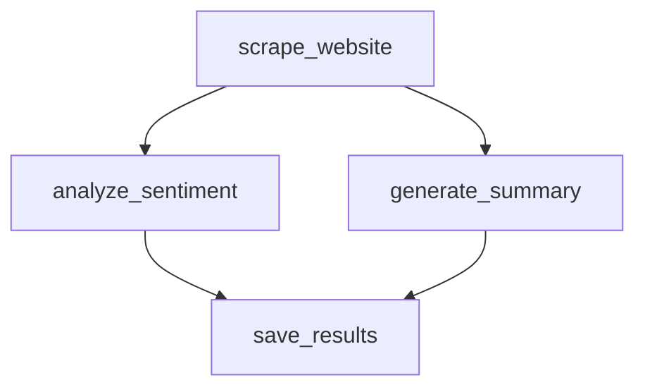

import { Aside, Steps, Tabs } from "@astrojs/starlight/components";
import { FileTree } from '@astrojs/starlight/components';
import NotProductionReady from '@/components/NotProductionReady.astro';

Now that pgflow is installed, let's create a simple workflow that demonstrates the core concepts.

<NotProductionReady />

We'll create a **website analysis workflow** that:
1. Fetches a website
2. Performs sentiment analysis and summarization in parallel
3. Saves the results to a database

<Aside type="caution" title="Prerequisites">
Before starting, make sure you have:
- Completed the [pgflow installation](/getting-started/install-pgflow/)
- A basic understanding of TypeScript
- A code editor like VS Code
</Aside>

<Steps>

1. ### Setup your project

    First, create a new directory for your workflow and set up a TypeScript project:

    ```bash frame="none"
    mkdir -p supabase/flows
    cd supabase/flows
    npm init -y
    npm install typescript @types/node --save-dev
    npx tsc --init
    ```

    Then add pgflow as a dependency:

    ```bash frame="none"
    npm install @pgflow/dsl --save
    ```

2. ### Create a flow definition

    Create a file named `analyze-website.ts` in the `flows` directory:

    ```typescript title="supabase/flows/analyze-website.ts"
    import { Flow } from '@pgflow/dsl';

    // Define the input type for our flow
    type AnalyzeWebsiteInput = {
      url: string;
    };

    // Create the flow definition
    export const AnalyzeWebsite = new Flow<AnalyzeWebsiteInput>({
      slug: 'analyze_website',
      // Optional: set flow-level retry and timeout defaults
      maxAttempts: 3,
      baseDelay: 5,
      timeout: 60,
    })
      // Step 1: Fetch the website content
      .step(
        { slug: 'scrape_website' },
        async (input) => {
          console.log(`Fetching website: ${input.run.url}`);
          // In a real implementation, you'd use fetch or another library
          return {
            content: `<html><body>This is content from ${input.run.url}</body></html>`,
            status: 200,
          };
        }
      )
      // Step 2: Analyze sentiment (depends on scrape_website)
      .step(
        { 
          slug: 'analyze_sentiment', 
          dependsOn: ['scrape_website'],
          // Optional: override flow-level settings
          maxAttempts: 5
        },
        async (input) => {
          console.log(`Analyzing sentiment for content from: ${input.run.url}`);
          // In a real implementation, you'd use an AI service
          return {
            score: 0.75,
            label: 'positive',
          };
        }
      )
      // Step 3: Generate summary (also depends on scrape_website)
      .step(
        { 
          slug: 'generate_summary', 
          dependsOn: ['scrape_website'] 
        },
        async (input) => {
          console.log(`Summarizing content from: ${input.run.url}`);
          // In a real implementation, you'd use an AI service
          return "This is a website about important topics.";
        }
      )
      // Step 4: Save results (depends on both analyze_sentiment and generate_summary)
      .step(
        { 
          slug: 'save_results', 
          dependsOn: ['analyze_sentiment', 'generate_summary'] 
        },
        async (input) => {
          // Notice how we can access outputs from all dependencies
          console.log(`Saving results for: ${input.run.url}`);
          console.log(`Sentiment: ${input.analyze_sentiment.label} (${input.analyze_sentiment.score})`);
          console.log(`Summary: ${input.generate_summary}`);
          
          // In a real implementation, you'd insert into the database
          return { status: "success" };
        }
      );

    // This is the default export that the compiler will use
    export default AnalyzeWebsite;
    ```

    <Aside>
    Note how the TypeScript type system ensures that:
    - The flow input type (`url`) is available in all steps as `input.run.url`
    - Each step's output becomes available to its dependent steps
    - You get full auto-completion for all available properties
    </Aside>

3. ### Compile the flow to SQL

    Now let's compile this TypeScript flow definition to SQL that can be applied to your database:

    ```bash frame="none"
    npx pgflow@latest compile supabase/flows/analyze-website.ts
    ```

    This will:
    1. Parse your TypeScript flow definition
    2. Generate the necessary SQL commands
    3. Create a timestamped migration file in your Supabase migrations folder
    
    The output will show where the migration file was created:
    
    ```
    ✓ Successfully compiled flow to SQL
    ✓ Migration file created: supabase/migrations/20250505120000_create_analyze_website_flow.sql
    ```

4. ### Apply the migration

    Apply the migration to create your flow in the database:

    ```bash frame="none"
    npx supabase db push
    ```

    This will execute the generated SQL migration and create your flow definition in the database.

5. ### Verify flow creation

    Let's verify the flow was created correctly using Supabase Studio:
    
    1. Open Supabase Studio in your browser (typically at http://localhost:54323)
    2. Navigate to the **SQL Editor**
    3. Run the following query:

    ```sql
    SELECT * FROM pgflow.flows WHERE flow_slug = 'analyze_website';
    ```

    You should see your flow in the output:

    ```
    flow_id | flow_slug       | created_at | updated_at | max_attempts | base_delay | timeout
    --------+-----------------+------------+------------+--------------+------------+--------
    UUID    | analyze_website | TIMESTAMP  | TIMESTAMP  | 3            | 5          | 60
    ```

</Steps>

<Aside>
Now your workflow is defined in the database and ready to be executed. The next step is to [set up a worker and trigger the flow](/getting-started/trigger-and-monitor/).
</Aside>

### Understanding the Flow Structure

The flow we created has this structure:



- `scrape_website` is a root step (no dependencies) that runs first
- `analyze_sentiment` and `generate_summary` run in parallel after `scrape_website` completes
- `save_results` only runs after both `analyze_sentiment` and `generate_summary` are complete

This pattern demonstrates the core concepts of pgflow:
- **Steps**: Discrete units of work
- **Dependencies**: Control flow between steps
- **Parallel execution**: Multiple steps can run concurrently
- **Data passing**: Outputs from one step are available as inputs to dependent steps