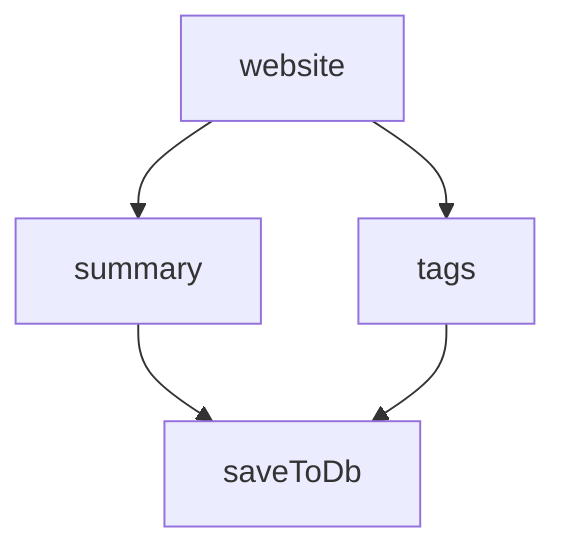

import { Aside, Steps, Tabs } from "@astrojs/starlight/components";
import { FileTree } from '@astrojs/starlight/components';
import NotProductionReady from '@/components/NotProductionReady.astro';

Now that pgflow is installed, let's create a website analysis workflow that demonstrates the core concepts.

<NotProductionReady />

Our website analysis workflow will:
1. Scrape a website's content
2. Generate a summary and extract tags in parallel using AI
3. Save results to the database

<Aside type="caution" title="Prerequisites">
Before starting, make sure you have:
- Completed the [pgflow installation](/getting-started/install-pgflow/)
- A basic understanding of TypeScript
- A code editor like VS Code
</Aside>

<Steps>

1. ### Set up your project structure

    First, let's create a project structure for our workflow:

    ```bash frame="none"
    mkdir -p supabase/functions/_flows supabase/functions/_tasks
    ```

    This organizes our code into two key parts:
    
    - `_tasks/` - Contains reusable building blocks that do one specific job (like fetching a website or analyzing text)
    - `_flows/` - Contains definitions that connect these tasks together, controlling how data moves between them
    
    Think of tasks as specialized workers (each with one skill) and flows as managers that coordinate which worker does what, when they should start, and how their work gets combined.
    
    :::note[Task Design Best Practice]
    Design your task functions to be as agnostic as possible about where their inputs come from. A well-designed task should:
    
    - Accept simple, focused parameters (like a URL or content string)
    - Perform one specific job well
    - Return clear results without assuming how they'll be used
    - Have no knowledge about other tasks or the overall flow
    
    **DO:**
    ```typescript
    // Good: Task accepts direct content parameter
    async function summarizeContent(content: string) {
      // Process the content directly
      return { summary: "Processed summary..." };
    }
    
    // In your flow:
    .step(
      { slug: 'summary', dependsOn: ['website'] },
      async (input) => await summarizeContent(input.website.content)
    )
    ```
    
    **DON'T:**
    ```typescript
    // Bad: Task expects specific step structure
    async function summarizeWebsite(input: { website: { content: string } }) {
      // Tightly coupled to previous step name and structure
      return { summary: "Processed summary..." };
    }
    
    // In your flow:
    .step(
      { slug: 'summary', dependsOn: ['website'] },
      async (input) => await summarizeWebsite(input) // Passing entire input object
    )
    ```
    
    This makes tasks reusable across different flows and easier to test in isolation.
    :::

    <FileTree>
    - supabase
      - functions
        - _flows
          - analyze_website.ts
        - _tasks
          - scrapeWebsite.ts
          - summarizeWithAI.ts
          - extractTags.ts
          - saveWebsite.ts
        - utils.ts
    </FileTree>

2. ### Create task implementations

    First, let's create the implementation for each task. These functions will be called by our flow steps.

    <Tabs>
      <Fragment slot="tab.scrapeWebsite">scrapeWebsite.ts</Fragment>
      <Fragment slot="tab.summarizeWithAI">summarizeWithAI.ts</Fragment>
      <Fragment slot="tab.extractTags">extractTags.ts</Fragment>
      <Fragment slot="tab.saveWebsite">saveWebsite.ts</Fragment>
      <Fragment slot="tab.utils">utils.ts</Fragment>

      <Fragment slot="panel.scrapeWebsite">
      ```typescript title="supabase/functions/_tasks/scrapeWebsite.ts"
      export default async function scrapeWebsite(url: string) {
        const response = await fetch(url);

        if (!response.ok) {
          throw new Error(`Failed to fetch website: ${response.status}`);
        }

        const rawContent = await response.text();

        // Extract text content from HTML
        const textContent = stripHtmlTags(rawContent);

        return {
          content: textContent,
        };
      }

      /**
       * Strips HTML tags from content and extracts text
       * Focuses on content within the body tag and removes scripts, styles, etc.
       */
      function stripHtmlTags(html: string): string {
        // Extract body content if possible
        const bodyMatch = html.match(/<body[^>]*>([\s\S]*?)<\/body>/i);
        const bodyContent = bodyMatch ? bodyMatch[1] : html;

        // Remove script and style tags and their contents
        let cleanedContent = bodyContent
          .replace(/<script\b[^<]*(?:(?!<\/script>)<[^<]*)*<\/script>/gi, '')
          .replace(/<style\b[^<]*(?:(?!<\/style>)<[^<]*)*<\/style>/gi, '');

        // Remove HTML tags but preserve line breaks
        cleanedContent = cleanedContent
          .replace(/<br\s*\/?>/gi, '\n')
          .replace(/<\/p>/gi, '\n\n')
          .replace(/<\/div>/gi, '\n')
          .replace(/<\/h[1-6]>/gi, '\n\n')
          .replace(/<\/li>/gi, '\n')
          .replace(/<[^>]*>/g, '');

        // Decode HTML entities
        cleanedContent = cleanedContent
          .replace(/&nbsp;/g, ' ')
          .replace(/&amp;/g, '&')
          .replace(/&lt;/g, '<')
          .replace(/&gt;/g, '>')
          .replace(/&quot;/g, '"')
          .replace(/&#39;/g, "'");

        // Remove excessive whitespace
        cleanedContent = cleanedContent
          .replace(/\n\s*\n\s*\n/g, '\n\n')
          .replace(/\s+/g, ' ')
          .trim();

        return cleanedContent;
      }
      ```
      </Fragment>

      <Fragment slot="panel.summarizeWithAI">
      ```typescript title="supabase/functions/_tasks/summarizeWithAI.ts"
      import Groq from 'groq-sdk';

      let _groq: Groq | undefined;

      function getGroq() {
        if (!_groq) {
          _groq = new Groq({
            apiKey: Deno.env.get('GROQ_API_KEY'),
          });
        }

        return _groq;
      }

      export default async (content: string) => {
        const chatCompletion = await getGroq().chat.completions.create({
          messages: [
            {
              role: 'user',
              content: `Please provide a concise summary of the following content:\n\n${content}`,
            },
          ],
          model: 'meta-llama/llama-4-scout-17b-16e-instruct',
        });

        return (
          chatCompletion.choices[0].message.content ??
          'Summary not available, please try again.'
        );
      };
      ```
      </Fragment>

      <Fragment slot="panel.extractTags">
      ```typescript title="supabase/functions/_tasks/extractTags.ts"
      import Groq from 'groq-sdk';

      let _groq: Groq | undefined;

      function getGroq() {
        if (!_groq) {
          _groq = new Groq({
            apiKey: Deno.env.get('GROQ_API_KEY'),
          });
        }

        return _groq;
      }

      export default async (content: string) => {
        const chatCompletion = await getGroq().chat.completions.create({
          messages: [
            {
              role: 'system',
              content: 'You extract relevant keywords and tags from website content.',
            },
            {
              role: 'user',
              content: `Extract the most important keywords and tags from the following website content.
      Return a JSON object with a single "keywords" field containing an array of strings.
      Focus on the most relevant and descriptive terms that represent the main topics and themes.
      Limit to 5-10 keywords maximum.
      
      Website content:
      ${content}`,
            },
          ],
          model: 'meta-llama/llama-4-scout-17b-16e-instruct',
          response_format: {
            type: 'json_object',
          },
        });

        // Parse the JSON response directly
        const responseJson = JSON.parse(
          chatCompletion.choices[0].message.content || '{}',
        );
        let keywords: string[] = []; // Default to empty array

        if (Array.isArray(responseJson.keywords)) {
          keywords = responseJson.keywords;
        }

        return {
          keywords: keywords,
        };
      };
      ```
      </Fragment>

      <Fragment slot="panel.saveWebsite">
      ```typescript title="supabase/functions/_tasks/saveWebsite.ts"
      import { createClient, type SupabaseClient } from '@supabase/supabase-js';
      import type { Database } from '../database-types.d.ts';

      let _supabase: SupabaseClient<Database> | undefined;

      function getSupabase(): SupabaseClient<Database> {
        if (!_supabase) {
          const SUPABASE_URL = Deno.env.get('SUPABASE_URL')!;
          const SUPABASE_SERVICE_ROLE_KEY = Deno.env.get(
            'SUPABASE_SERVICE_ROLE_KEY',
          )!;
          _supabase = createClient<Database, 'public'>(
            SUPABASE_URL,
            SUPABASE_SERVICE_ROLE_KEY,
          );
        }

        return _supabase;
      }

      export default async (websiteData: {
        user_id: string;
        website_url: string;
        summary: string;
        tags: string[];
      }) => {
        const { data } = await getSupabase()
          .schema('public')
          .from('websites')
          .insert([websiteData])
          .select('*')
          .single()
          .throwOnError();
        console.log('results', data);

        return { success: true, website: data };
      };
      ```
      </Fragment>

      <Fragment slot="panel.utils">
      ```typescript title="supabase/functions/utils.ts"
      // this function sleeps for ms number of milliseconds
      export async function sleep(ms: number) {
        return new Promise((resolve) => setTimeout(resolve, ms));
      }

      // this function sleeps for a random number of milliseconds between min and max
      export async function randomSleep(min: number, max: number) {
        const ms = Math.floor(Math.random() * (max - min + 1) + min);
        await sleep(ms);
      }

      const FAILURE_URL = 'https://firebase.google.com/';

      /**
       * Simulates a random failure with a 50% probability
       * Optionally checks for a specific value that always fails
       */
      export async function simulateFailure(url: string): Promise<void> {
        // Only fail if the URL matches our test failure URL
        if (url === FAILURE_URL) {
          throw new Error('Simulated random failure to demonstrate error handling');
        }
      }
      ```
      </Fragment>
    </Tabs>

    <Aside>
    Note: The tasks use services like Groq for AI processing and Supabase for database access. 
    In a real implementation, you'll need to set up appropriate environment variables.
    </Aside>

3. ### Define the website analysis flow

    Now, let's create the main flow definition that ties everything together:

    ```typescript title="supabase/functions/_flows/analyze_website.ts"
    import { Flow } from '@pgflow/dsl';
    import scrapeWebsite from '../_tasks/scrapeWebsite.ts';
    import summarizeWithAI from '../_tasks/summarizeWithAI.ts';
    import extractTags from '../_tasks/extractTags.ts';
    import saveWebsite from '../_tasks/saveWebsite.ts';
    import { simulateFailure } from '../utils.ts';

    type Input = {
      url: string;
      user_id: string;
    };

    export default new Flow<Input>({
      slug: 'analyze_website',
      maxAttempts: 3,
      timeout: 4,
      baseDelay: 1,
    })
      .step(
        { slug: 'website' },
        async (input) => await scrapeWebsite(input.run.url),
      )
      .step(
        { slug: 'summary', dependsOn: ['website'] },
        async (input) => await summarizeWithAI(input.website.content),
      )
      .step({ slug: 'tags', dependsOn: ['website'] }, async (input) => {
        await simulateFailure(input.run.url);

        const { keywords } = await extractTags(input.website.content);
        return keywords;
      })
      .step({ slug: 'saveToDb', dependsOn: ['summary', 'tags'] }, async (input) => {
        const websiteData = {
          user_id: input.run.user_id,
          website_url: input.run.url,
          summary: input.summary,
          tags: input.tags,
        };
        const { website } = await saveWebsite(websiteData);

        return website;
      });
    ```

    <Aside>
    This flow definition shows the key features of pgflow:
    - Strongly typed input and output between steps
    - Explicit dependencies between steps
    - Built-in retry and error handling
    - Parallel execution of independent steps
    </Aside>

4. ### Compile the flow to SQL

    Next, compile your flow definition to SQL using the pgflow CLI:

    ```bash frame="none"
    npx pgflow@latest compile supabase/functions/_flows/analyze_website.ts
    ```

    This generates a migration file with the SQL needed to register your flow in the database:

    ```
    ✓ Successfully compiled flow to SQL
    ✓ Migration file created: supabase/migrations/20250505120000_create_analyze_website_flow.sql
    ```

5. ### Apply the migration

    Apply the migration to register your flow in the database:

    ```bash frame="none"
    npx supabase db push
    ```

    This will execute the SQL migration and make your flow available for execution.

</Steps>

### Understanding the Flow Structure

The analyze_website flow has this structure:



This demonstrates the core concepts of pgflow:

1. **Parallel processing**: After the website is scraped, both the summary and tag extraction happen in parallel
2. **Data dependencies**: The saveToDb step only runs after both summary and tags are complete
3. **Error handling**: Each step automatically includes retry logic (controlled by maxAttempts and baseDelay)
4. **Type safety**: Data is passed between steps in a type-safe manner

### Important Flow Features

Our workflow includes several important features:

- **Flow-level options**:
  - `slug`: A unique identifier for the flow
  - `maxAttempts`: Maximum number of retry attempts (3)
  - `timeout`: How long a step can run before timing out (4 seconds)
  - `baseDelay`: Initial delay between retries (1 second)

- **Step configuration**:
  - `slug`: Unique identifier for each step
  - `dependsOn`: Array of step slugs that must complete before this step runs

- **Error simulation**:
  - The tags step includes error simulation to demonstrate retry behavior
  - In a production environment, this helps handle transient failures

<Aside>
Now your workflow is defined in the database and ready to be executed. The next step is to [set up a worker and trigger the flow](/getting-started/trigger-and-monitor/).
</Aside>