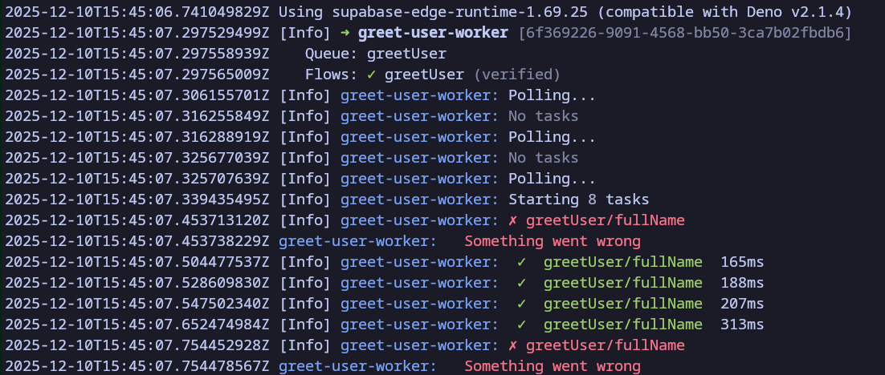

import { Aside } from "@astrojs/starlight/components";

pgflow 0.10.0 is a developer experience milestone. This release eliminates two of the biggest friction points in pgflow development: manual flow compilation and worker lifecycle management.

## Highlights

- **Auto-compilation at startup** - Workers verify and compile flows automatically
- **Intelligent worker management** - Database-driven cron keeps workers running reliably
- **Beautiful local logging** - Colored output with retry information and exponential backoff display

## Auto-Compilation: Never Compile Manually Again

Previously, every flow change required running `pgflow compile`, dropping old flow data with 'pgflow.delete_flow_and_data()' and migrating database, all before you can test your flow. This release introduces automatic flow compilation and previous version deletion that happens when workers start.

### How It Works

When a worker starts, it calls the new `ensure_flow_compiled()` function which:

1. **Checks if the flow exists** - If not, compiles it immediately
2. **Compares flow shapes** - Verifies the TypeScript definition matches the database
3. **Auto-recompiles in development** - Detects local Supabase and just deletes previous version and compiles new one
4. **Fails safely in production** - Returns an error instead of deleting/recompiling

### Why This Matters

This achieves full **watch-mode** in local **development**:

- Change your flow definition in TypeScript
- Supabase detects the change and starts new function
- Cron polls the function, starting new worker automatically
- Flow is compiled and ready - no manual step required

And a convenient "deploy updated flow, no need for migrations" workflow on **production**:

- Production worker only compiles new flows
- Mismatches are caught immediately with clear error messages, worker refuses to start

### Configuration

Auto-compilation is enabled by default. To opt out:

```typescript
EdgeWorker.start(MyFlow, {
  ensureCompiledOnStartup: false,
});
```

## Worker Management: Set It and Forget It

Managing worker lifecycles on hosted Supabase has been a pain point. Edge Functions have CPU time limits, worker contantly respanw themselves for continuos operation and to make it reliable one needed to setup a manual cron schedule.

pgflow 0.10.0 introduces built-in worker management that handles all of this automatically.

### The Worker Management System

Each worker function (edge function having EdgeWorker.start()) is tracked in new `pgflow.worker_functions` table.

When you install 0.10.0 migrations, it will setup a new `pgflow_ensure_workers` cron job runs every second and:

1. **Tracks registered workers** from the `worker_functions` table
2. **Detects dead workers** - Uses heartbeats and `stopped_at` timestamps
3. **Invokes workers when needed** - Pings edge functions via HTTP to spawn new workers
4. **Debounces intelligently** - Prevents spawning too many workers simultaneously
5. **Only invokes HTTP requests** when needed, saving on invocations and egress.

### Why This Matters

**Before 0.10.0:**
- Set up manual `pg_cron` jobs with watchdog logic
- Workers died and stayed dead until manually restarted
- Risk of spawning too many workers under load

**After 0.10.0:**
- Workers register themselves automatically
- Dead workers are detected and replaced within seconds
- Debouncing prevents worker storms
- Graceful shutdown signals prevent false-positive restarts

### Production Credentials

The worker management system uses Vault secrets to invoke edge functions:

- `supabase_service_role_key` - For authentication
- `supabase_project_id` - To build the function URL

<Aside type="tip" title="Local Development">
In local development, the system automatically uses `http://kong:8000/functions/v1` without authentication, so you don't need to configure anything for local testing.

It will also ping functions every 1s without any debounce in order to respawn new workers after a code change as soon as possible.
You can override this by calling `pgflow.setup_ensure_workers_cron('10 seconds')` with your value manually.
</Aside>

## Structured Logging: See What Matters

The new logging system adapts to your environment automatically.

### Local Development (Fancy Format)



Features:
- Colored icons (green checkmarks, red X, yellow retry arrows)
- Worker-prefixed lines for multi-worker clarity
- Flow/step paths for context
- Retry countdown with exponential backoff calculation

### Production (Simple Format)

```
[INFO] worker=analyze-website queue=pgflow_tasks flow=analyze_website status=verified worker_id=abc123
[VERBOSE] worker=analyze-website flow=analyze_website step=scrape status=completed duration_ms=127
[VERBOSE] worker=analyze-website flow=analyze_website step=analyze status=failed error="Rate limit" retry=1/3 retry_delay_s=5
```

Features:
- Structured `key=value` format for log aggregators
- Appropriate log levels (INFO, VERBOSE, DEBUG)
- All context included for filtering and alerting

### Configuration

The format is auto-detected based on environment, but you can override:

```bash frame="none"
# Force fancy format in production (not recommended)
EDGE_WORKER_LOG_FORMAT=fancy

# Set log level explicitly
EDGE_WORKER_LOG_LEVEL=debug  # error < warn < info < verbose < debug

# Disable colors (respects NO_COLOR standard)
NO_COLOR=1
```

<Aside type="tip">
For filtering Supabase Edge Runtime noise during local development, see [Local Development](/build/local-development/).
</Aside>

## Breaking Changes

None. All new features are additive and existing workflows continue to work unchanged.

## Upgrade Now

Follow the standard [Update pgflow](/deploy/update-pgflow/) guide to update packages and apply migrations.

### Remove Old Watchdog Cron Jobs

pgflow now sets up the `pgflow_ensure_workers` cron automatically during migration. If you previously set up manual cron jobs to keep workers running (from older documentation), remove them:

```sql
-- Check for old watchdog jobs
SELECT jobid, jobname, schedule, command
FROM cron.job
WHERE jobname LIKE '%watchdog%'
   OR command LIKE '%invoke%function%';

-- Remove old jobs (replace ID with actual jobid)
SELECT cron.unschedule(jobid) FROM cron.job WHERE jobname LIKE '%watchdog%';
```

Questions or issues? Open a [GitHub issue](https://github.com/pgflow-dev/pgflow/issues) or join the discussion on [Discord](https://pgflow.dev/discord/).
